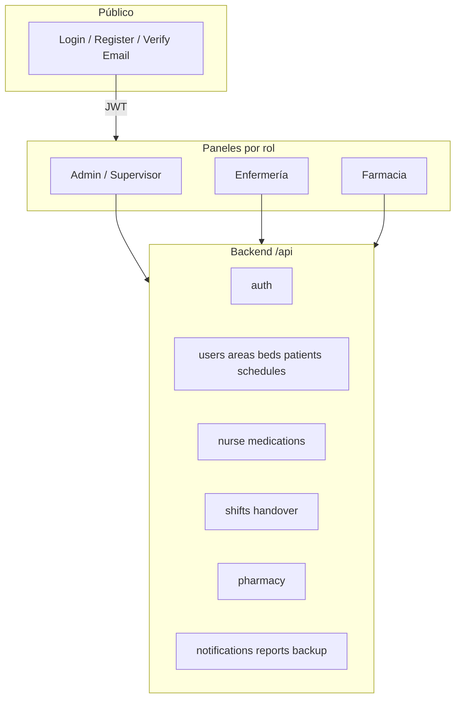
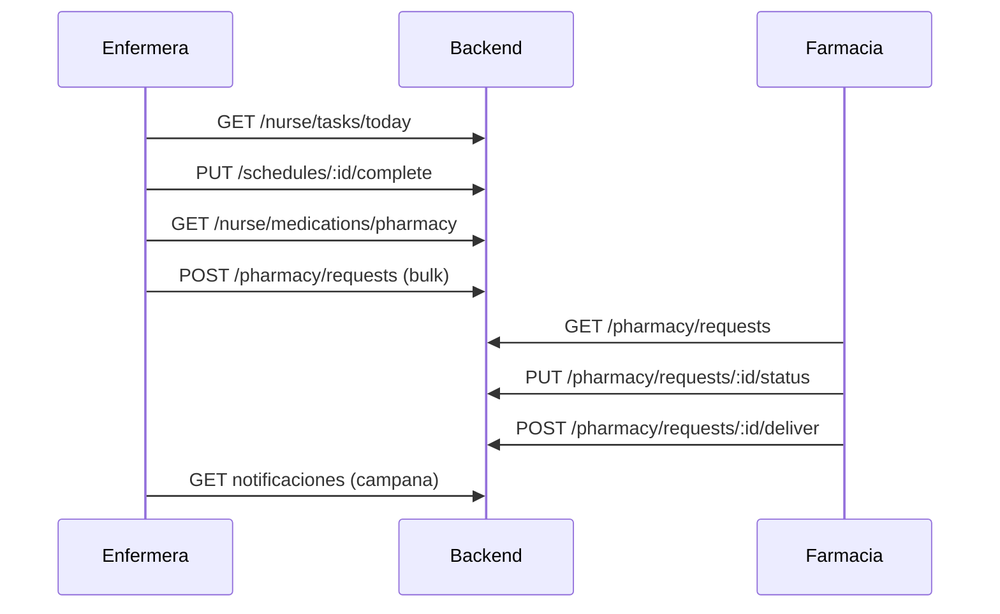

# NurseHelper — Funcionalidad actual del proyecto

Documento de inventario: módulos, flujos y uso real (frontend + backend).  
**Fecha de referencia:** mayo 2026.

---

## 1. Visión general

**NurseHelper** es una aplicación hospitalaria para coordinar enfermería, supervisión, administración y farmacia en un mismo sistema:

| Rol | Ruta principal | Propósito |
|-----|----------------|-----------|
| **Admin** | `/admin` | Configuración global: usuarios, áreas, camas, pacientes, horarios de enfermeras |
| **Supervisor** | `/supervisor` | Misma operativa que admin, con UI ligeramente distinta (sin algunos hosts admin) |
| **Enfermera** | `/nurse-dashboard` | Turno diario: tareas, pacientes, camas, solicitudes a farmacia, notas de entrega |
| **Farmacia** | `/pharmacy` | Cola de solicitudes, inventario, entregas, asistencia por turno |

**Stack:** Angular 20 (frontend) + Express + TypeORM + MySQL (backend). Autenticación JWT.

---

## 2. Arquitectura y flujo global

**Flujo típico de sesión:**

1. Usuario entra por `/login` → `AuthService` guarda token y rol.
2. Guard de ruta redirige al panel según rol (`adminGuard`, `supervisorGuard`, `pharmacyGuard`, o `authGuard` para enfermería).
3. Todas las peticiones HTTP pasan por `authInterceptor` (Bearer + timeout 15 s + logout en 401).
4. Cada panel consume servicios Angular que llaman a los endpoints REST correspondientes.

---

## 3. Rutas frontend (en uso)

Archivo: `frontend/src/app/app.routes.ts`

| Ruta | Guard | Carga | Componente |
|------|-------|-------|------------|
| `/login` | — | Eager | Login |
| `/register` | — | Eager | Registro (rol fijado a enfermera) |
| `/verify-email` | — | Eager | Verificación de email |
| `/admin` | `adminGuard` | Lazy | Admin dashboard |
| `/supervisor` | `supervisorGuard` | Lazy | Supervisor dashboard |
| `/nurse-dashboard`, `/dashboard` | `authGuard` | Lazy | Panel enfermería |
| `/pharmacy` | `pharmacyGuard` | Lazy | Panel farmacia |
| `/asistencia` | `pharmacyGuard` | Lazy | Asistencia farmacia (página dedicada) |
| `/use-case-diagram` | `authGuard` | Lazy | Diagrama UML estático (documentación visual) |

**Retirado del repo:** `/design-catalog` (catálogo UI de desarrollo; ya no existe ruta ni E2E).

---

## 4. Panel Admin y Supervisor

**Shell compartido:** `StaffDashboardShellComponent`  
**Pestañas:** `staff-dashboard-shell-tabs.ts` (emojis en etiquetas; Resumen con 📊).

| Pestaña | Componente | Funciones en uso |
|---------|------------|------------------|
| **Resumen** | `OverviewComponent` | KPIs (usuarios, áreas, camas, pacientes, enfermeras), reloj en vivo, turno actual (`ShiftsService`, `ShiftRealtimeService`), accesos rápidos a otras pestañas / coordinación / reportes |
| **Usuarios** | `UsersManagementComponent` | Listado paginado, filtros, edición, cambio de rol, baja/restauración, export CSV, supervisores y farmacia en bloques separados |
| **Enfermeras** | `StaffManagementComponent` | Búsqueda/filtros por área y presencia, ficha de enfermera, pacientes asignados, asignación de paciente con cama, edición de datos |
| **Áreas** | `AreasManagementComponent` | CRUD áreas, camas por área, pacientes sin área / por área, hojas de acción (cambiar cama, liberar, asignar área) |
| **Camas** | `BedsManagementComponent` | Inventario de camas, asignación paciente–cama–enfermera vía `AdminPatientBedAssignmentService` |
| **Pacientes** | `PatientsManagementComponent` | Ingreso (datos personales, emergencia, ubicación, clínica), listado con filtros, export CSV/Excel, edición, eliminación; **toggle activo/inactivo: UI sin API** |
| **Horarios** | `SchedulesManagementComponent` | Calendario semanal de turnos, asistencia, día libre, asignación masiva |

**Servicios admin en uso:** `AdminService`, `ShiftsService`, `ReportService` (vía quick actions), `AdminPatientBedAssignmentService`, `AdminNursePickModalService`, `AdminShiftCoverageAlertNavigationService`, `UserNotificationsService`, `ExportService`.

**Extras UI:**

- `StaffDashboardQuickActionsToolbar` / `StaffQuickActionsService`: coordinación de turno (nota admin) y reportes globales.
- `InAppNotificationsBellComponent`: notificaciones in-app.
- `PharmacyCoverageSummaryCard`: cobertura de contacto farmacia por turno (visible en admin; supervisor la muestra arriba del contenido).
- `AdminTeamHandoverModal`: notas de coordinación administrativa.

**Diferencias supervisor vs admin:** mismo conjunto de pestañas; supervisor integra quick actions en nav; admin tiene drawer móvil y host del modal “elegir enfermera”.

---

## 5. Panel Enfermería

**Shell:** `DashboardShellComponent` + `NurseDashboardMainNavComponent`  
**Orquestador:** `NurseDashboardComponent` (estado grande; lógica delegada a **facades** y helpers).

### 5.1 Vistas principales (pestañas)

| Vista | Componente | API / servicio principal |
|-------|------------|---------------------------|
| **Resumen** | `NurseSummarySection` | `NurseService.getStats`, alertas derivadas de stats y farmacia |
| **Tareas** | `NurseTasksSection` | `getTodayTasks`, `getDayTasksHistory`, completar / no realizada / posponer |
| **Farmacia** | `NursePharmacySection` | `getPharmacyMedications`, solicitudes; envío masivo vía facade |
| **Camas** | `NurseBedsSection` | `getMyBeds` |
| **Pacientes** | `NursePatientsAssignedSection` | `getMyPatients`, búsqueda en cabecera |

**Nav:** Resumen mantiene emoji 📊; resto usa `app-bootstrap-icon`. Acciones rápidas: **Entrega** (handover), **Reportes** (últimos 7 días).

**Persistencia:** vista activa en `localStorage` (`NURSE_DASHBOARD_MAIN_VIEW_STORAGE_KEY`).

### 5.2 Modal de paciente (flujo clínico)

`NursePatientModalShellComponent` → pestañas:

| Pestaña | Componente | Operaciones |
|---------|------------|-------------|
| Medicamentos | `NursePatientMedicationsTab` | Listado del día, marcar administrado/no administrado, suspender, reactivar, eliminar horario, agregar |
| Tratamientos | `NursePatientTreatmentsDayTab` | Tratamientos del día, realizado/posponer/cancelar/editar/eliminar |
| Observaciones | `NursePatientObservationsTab` | Diagnóstico, evolución, alergias, necesidades especiales, notas generales (append con fecha) |
| Historial | `NursePatientHistoryTab` | Administraciones y tratamientos históricos, ver/editar/eliminar |

**Modales asociados (overlays):** agregar medicamento/tratamiento, posponer tarea/tratamiento, no completada, detalle pendiente, detalle medicación día, historial detalle, slots de horarios, etc. (`NurseDashboardOverlaysStackComponent`).

### 5.3 Facades (capa de orquestación — en uso)

Cada facade envuelve llamadas a `NurseService` / `PharmacyService` / `ReportService` para el componente principal:

| Facade | Responsabilidad |
|--------|-----------------|
| `NurseDashboardPrimaryLoadFacade` | Carga inicial: stats + camas + pacientes |
| `NurseDashboardSecondaryLoadFacade` | Tareas del día + medicación farmacia + contexto de turno |
| `NurseDashboardPatientDetailsLoadFacade` | Detalle de paciente al abrir modal |
| `NurseDashboardMyPatientsSearchFacade` | Búsqueda global en cabecera |
| `NurseDashboardCompleteTaskFacade` | Completar tarea |
| `NurseDashboardTaskLifecycleFacade` | No realizada, posponer |
| `NurseDashboardTasksDayHistoryFacade` | Historial por fecha |
| `NurseDashboardMedicationMutationFacade` | Suspender / eliminar / reactivar medicación |
| `NurseDashboardPatientCareCreateFacade` | Alta medicación o tratamiento |
| `NurseDashboardPatientClinicalWriteFacade` | Guardar observaciones clínicas |
| `NurseDashboardPatientRecordPatchFacade` | Parche historial y agenda |
| `NurseDashboardPatientScheduleWriteFacade` | Eliminar ítem de agenda |
| `NurseDashboardTreatmentScheduleFacade` | Aceptar / cancelar / posponer tratamiento |
| `NurseDashboardAdministrationHistoryWriteFacade` | Eliminar registro de historial |
| `NurseDashboardHandoverNoteFacade` | Nota de entrega de turno |
| `NurseDashboardPharmacyBulkFacade` | Envío masivo de solicitudes a farmacia |
| `NurseDashboardNurseReportsLoadFacade` | Bundle reportes medicación + cumplimiento |

### 5.4 Otros modales enfermería (fuera del modal paciente)

- `NurseHandoverModal` / nota de paso por fecha y turno.
- `NurseReportsModal` — export CSV/Excel cumplimiento y medicación.
- `NurseTasksQuickModal`, `NursePharmacyQuickModal` — accesos desde resumen.
- `NursePharmacyPatientsModal` — pacientes por medicamento.

---

## 6. Panel Farmacia

**Componente:** `PharmacyDashboardComponent`  
**Secciones:** `requests` | `history` | `inventory` + enlace `/asistencia`.

| Sección | Funciones |
|---------|-----------|
| **Solicitudes** | KPIs (pendiente, en preparación, listo, entregado hoy), filtros, cambio de estado, entrega, detalle |
| **Historial** | Entregas y cancelaciones con búsqueda y rango de fechas |
| **Inventario** | Stock, mínimos, caducidad, movimientos (kardex), alta/edición/baja de medicamento, ajuste de stock |
| **Asistencia** | `PharmacyAttendancePageComponent` + `PharmacyShiftAttendanceSection` — quién cubre farmacia por turno |

**Servicio:** `PharmacyService` (solicitudes, inventario, entregas, asistencia, turnos de trabajo).

---

## 7. Autenticación y servicios transversales (frontend)

| Servicio | Uso real |
|----------|----------|
| `AuthService` | Login, registro, verify-email, token, perfil, rutas por rol |
| `ToastService` | Feedback en toda la app |
| `ConfirmationService` | Confirmaciones destructivas / advertencias |
| `UserNotificationsService` | Campana in-app (admin, supervisor, enfermería) |
| `ExportService` | CSV/Excel en admin y reportes enfermería |
| `ShiftRealtimeService` | Turno actual en resumen admin y asistencia farmacia |
| `DashboardTabStateService` | Pestaña activa admin/supervisor en `localStorage` |
| `LoadingService` | Conectado en `app.html` pero **ningún módulo llama `start()`/`stop()`** |
| `LoadingDirective` | **No usada** en plantillas |

**Interceptor:** `authInterceptor` — JWT, timeout, reintentos en red, logout en 401.

**Guards:** `authGuard`, `adminGuard`, `supervisorGuard`, `pharmacyGuard`.  
**Nota:** `/nurse-dashboard` solo exige autenticación, no rol `nurse` explícito.

---

## 8. Componentes compartidos relevantes

| Componente | Dónde se usa |
|------------|--------------|
| `staff-dashboard-shell` | Admin, supervisor |
| `dashboard-shell` | Enfermería, farmacia |
| `in-app-notifications-bell` | Cabeceras con notificaciones |
| `dashboard-user-profile-modal` | Edición perfil (nombre, teléfono, roster farmacia) |
| `staff-dashboard-quick-actions` | Coordinación + reportes |
| `pharmacy-coverage-summary-card` | Admin/supervisor (áreas / layout supervisor) |
| `admin-nurse-pick-modal-host` | Flujo asignación paciente–enfermera |
| `admin-team-handover-modal` | Coordinación administrativa |
| `admin-table-row-actions-modal` | Acciones en móvil (hoja inferior) |
| `modal-shell`, `pagination`, `confirmation-wrapper`, `toast` | Patrones globales |
| `bootstrap-icon` | Iconografía UI (sustituye Heroicons) |

---

## 9. Backend — API en uso por dominio

Prefijo base: `/api` (salvo `/health`). Entrada: `backend/src/app.ts`.

### 9.1 Autenticación (`/api/auth`)

- Login, registro, verificación email, reenvío código.
- `GET/PATCH /me` — perfil propio.

### 9.2 Administración

| Módulo | Endpoints clave | Roles |
|--------|-----------------|-------|
| **users** | CRUD, cambio rol, restore | admin, supervisor |
| **areas** | CRUD, `shift-coverage` | lectura: todos; escritura: admin, supervisor |
| **beds** | CRUD, assign | admin, supervisor; patch enfermera en su área |
| **patients** | CRUD, observaciones | admin/supervisor escritura; enfermera observaciones acotadas |
| **schedules** | CRUD tareas, complete, not-completed, postpone, medication-given | mixto |
| **shifts** | semanal, asistencia, handoff, presentes, historial | admin, supervisor |

### 9.3 Enfermería (`/api/nurse`)

- Stats, shift-context, handover-notes.
- Camas y pacientes (`/beds`, `/patients`, detalle, búsqueda).
- Tareas: `tasks/today`, `tasks/day-history`.
- Medicación vista farmacia: `medications/pharmacy`.
- Tratamientos, administración, historial, parches de schedules e historial.

### 9.4 Medicación (`/api/medications`)

- Por paciente: listar, agregar con horarios, suspender, reactivar, eliminar.

### 9.5 Farmacia (`/api/pharmacy`)

- Solicitudes, cambio estado, entrega, historial entregas.
- Inventario, movimientos, stock, alta/baja.
- Turnos de trabajo y asistencia (`shift-attendance`).

### 9.6 Transversal

| Módulo | Función |
|--------|---------|
| **reports** | Medicación, cumplimiento, export (rate limit) |
| **handover** | Notas admin (`/admin-notes`) |
| **notifications** | In-app por usuario |
| **backup** | Crear, listar, restaurar, verificar (solo admin) |
| **webhooks** | Registro y prueba (solo admin) |
| **health** | Liveness, readiness, métricas |

### 9.7 Entidades de datos (TypeORM)

`User`, `Area`, `Bed`, `Patient`, `Schedule`, `Shift`, `NurseShift`, `ShiftAttendance`, `PharmacyShiftAttendance`, `Medication`, `MedicationRequest`, `DeliveryHistory`, `AdministrationHistory`, `MedicationInventoryMovement`, `ShiftHandoverNote`, `AdminHandoverNote`, `PatientClinicalNote`, `UserNotification`, `PendingRegistration`.

### 9.8 Jobs y respaldos

- **Cron in-app:** `notification-jobs.service.ts` — alertas de cobertura de área y tareas (intervalo configurable, ~120 s).
- **Backup shell:** `backend/backup-db.sh` → `backups/bdresp1_*.sql.gz` + symlink `bdresp1_latest.sql.gz`.
- **Backup API:** `backup.service.ts` + rutas `/api/backup` (requiere `BACKUP_ENABLED` y rol admin).

---

## 10. Código backend con poco o ningún uso en runtime

| Elemento | Estado |
|----------|--------|
| `backend/src/services/nurse.service.ts` | Legacy monolítico; sustituido por `nurse-*.service.ts`; sin imports en producción |
| `backend/src/services/medication.service.ts` | No importado; lógica en `medications.controller` |
| `pagination.middleware.ts`, `validation.middleware.ts` | Solo tests |
| `GET /health-basic` | Duplicado de `/health` |
| `PUT` y `POST` en `/beds/:id/assign` | Misma función, ruta duplicada |

---

## 11. Pruebas automatizadas (cobertura real)

### Frontend (Jest/Karma)

- Specs unitarios en componentes, facades y servicios (incl. `bootstrap-icon`, campana notificaciones, shells).
- Mucha cobertura en módulo enfermería tras modularización por facades.

### Frontend (Playwright E2E)

| Spec | Qué valida |
|------|------------|
| `root-and-public-routes` | Redirecciones y formularios públicos |
| `login` | Login inválido/válido (admin requiere BD) |
| `role-routes-guard` | Rutas protegidas sin sesión |
| `nurse-dashboard-guard` | Enfermería sin sesión |
| `use-case-diagram-guard` | Diagrama sin sesión |
| `nurse-dashboard-smoke` | Shell enfermería con **API mockeada** |
| `nurse-dashboard-main-nav-keyboard` | Navegación teclado entre pestañas |

**No hay E2E** de flujos admin, farmacia ni CRUD clínico con BD real.

### Backend (Jest)

- Unitarios de controladores, integración, endpoints completos, notificaciones, BD.

---

## 12. Diagrama de flujo clínico principal (enfermería → farmacia)

---

## 13. Resumen: qué está “vivo” vs atado

| Área | Estado |
|------|--------|
| Gestión hospitalaria admin/supervisor | **En producción de código**, uso activo |
| Panel enfermería + facades | **Núcleo del producto**, muy desarrollado |
| Farmacia solicitudes + inventario | **En uso** |
| Notificaciones in-app + jobs cobertura | **En uso** |
| Reportes y exportaciones | **En uso** (admin quick actions + enfermería) |
| Registro público | **Parcial** (solo rol enfermera en UI) |
| Toggle activo paciente | **UI sin backend** |
| Loading global | **Cableado, no activado** |
| `/use-case-diagram` | **Herramienta auxiliar**, no operativa |
| Heroicons SVG / design-catalog | **Eliminados** del árbol actual |
| `nurse.service.ts` backend legacy | **Muerto** en runtime |

---

*Para mejoras y nuevas funcionalidades sugeridas, ver `docs/RECOMENDACIONES.md`.*
